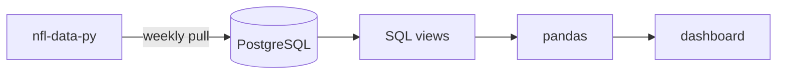

## Building systems, slinging data, developing games

### 🌊 What I'm Up To 🌊

* **Game Dev & Systems** 
  **Godot**, solo and occasional team
  projects. I enjoy designing the systems and pulling together dynamic intricate concepts. 
  Surface some of the interesting data relationships through technical art and audio conceptualization.
* **Data & Code**  
  Building an NFL analytics dashboard with PostgreSQL, pandas, and
  considering Streamlit. Working through Boot.dev curriculum on the side (currently pandas).
* **Audio Engineering** 
  Mixing, mastering, and sound procurement.
  Always looking to pour my heart into something and make it real with sound design.

### 🧠 Current Stack 🧠
Python · SQL / PostgreSQL · pandas · Power BI · Godot / GDScript · Git  
 
## Click for details:

<b>🏈 My NFL Data Project Outline</b>

<b>⚙️ Current PC Specs</b>
  
 

| | |
| --- | --- |
| **CPU** | Ryzen 7 5800X3D (8-core) |
| **GPU** | RTX 5080 (16 GB) |
| **RAM** | 64 GB |
| **Storage** | 1 TB Crucial NVMe + 2 TB WD_BLACK SN850X |

<b>🐻 Boot.dev History</b> — 8 courses, 4 projects, league placements

 

**Courses**

| Track | Course | Completed |
| --- | --- | --- |
| Data | SQL | Apr 2026 |
| Data | Power BI | Apr 2026 |
| CS Core | Data Structures and Algorithms in Python | Dec 2025 |
| Foundations | Functional Programming in Python | Apr 2025 |
| Foundations | Object Oriented Programming in Python | Jan 2025 |
| Tooling | Git | Jan 2025 |
| Tooling | Linux | Dec 2024 |
| Foundations | Python for Beginners | Dec 2024 |

**Projects**

| Project | Focus | Completed |
| --- | --- | --- |
| AI Agent | LLM tool calling, function dispatch | Dec 2025 |
| Static Site Generator | Parsing, recursion, HTML generation | May 2025 |
| Asteroids | Pygame, game loops, collision | Apr 2025 |
| BookBot | File I/O, text analysis | Jan 2025 |

**League Placements**

| Season | Placement | XP | Ended |
| --- | --- | --- | --- |
| Dawnbound Vampire | 🥈 #2 | 35,630 | May 2026 |
| Silver Netherdrake | 🥉 #3 | 48,596 | Apr 2026 |

  

